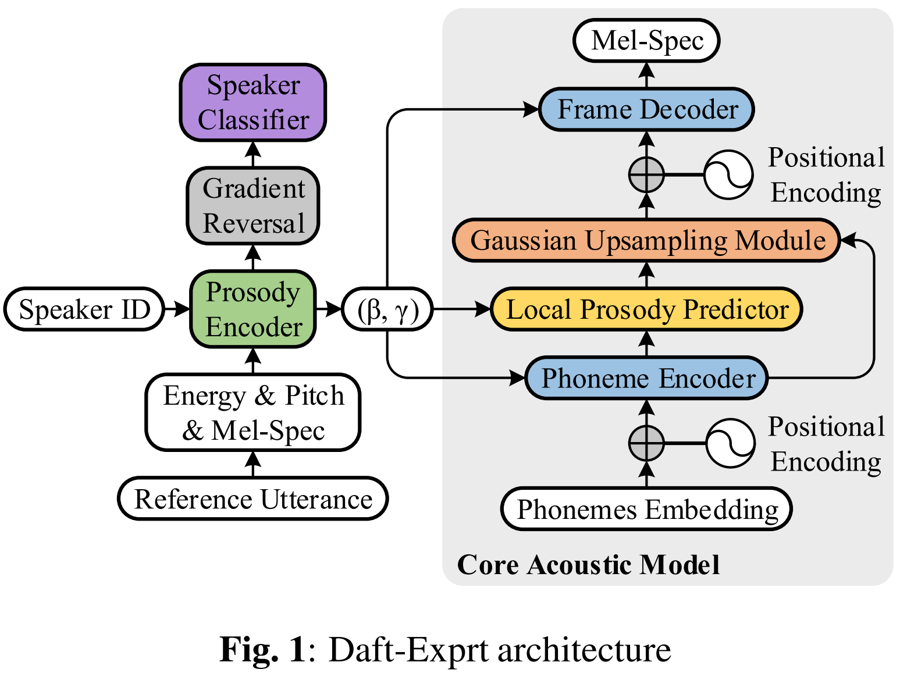
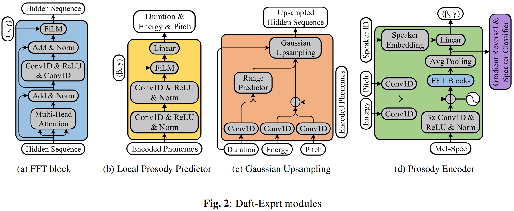
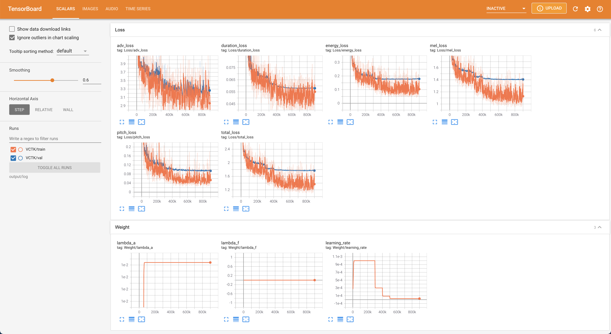
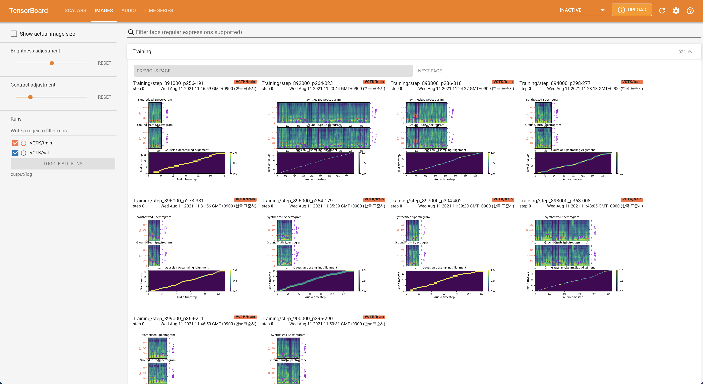
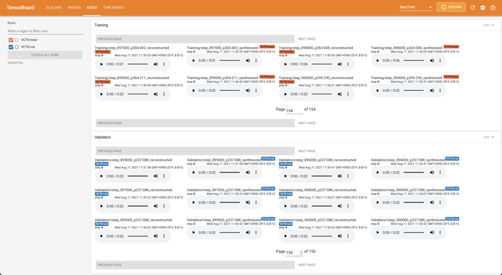
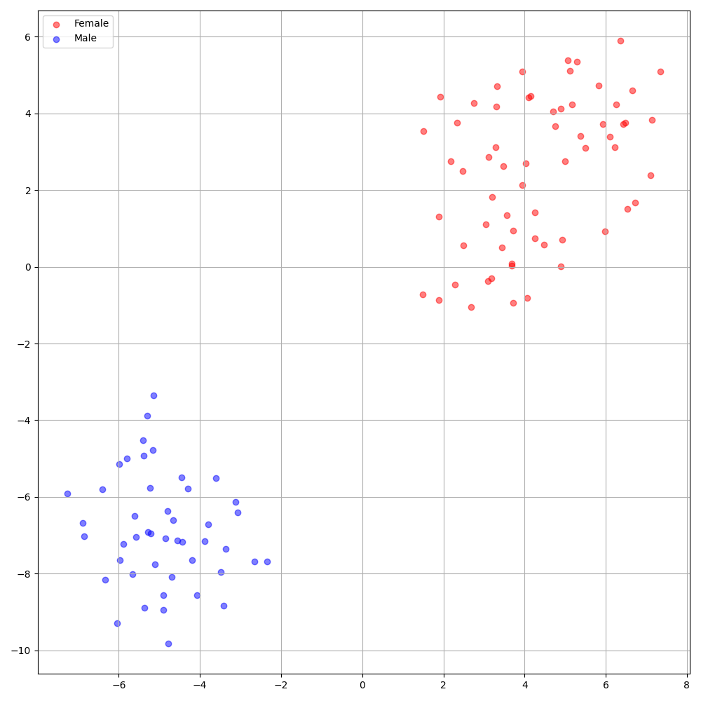

# Daft-Exprt - PyTorch Implementation

PyTorch Implementation of [Daft-Exprt: Robust Prosody Transfer Across Speakers for Expressive Speech Synthesis](https://arxiv.org/abs/2108.02271)

<p align="center">
    
</p>

<p align="center">
    
</p>

The validation logs up to 70K of synthesized mel and alignment are shown below (VCTK_val_p237-088).

<p align="center">
    
</p>

# Quickstart

***DATASET*** refers to the names of datasets such as `VCTK` in the following documents.

## Dependencies
You can install the Python dependencies with
```
pip3 install -r requirements.txt
```
Also, `Dockerfile` is provided for `Docker` users.

## Inference

You have to download the [pretrained models](https://drive.google.com/drive/folders/1rmeW24lrCg_qwPkVI0D4bRNq4HSv_4rE?usp=sharing) and put them in `output/ckpt/DATASET/`.

For a **multi-speaker TTS**, run
```
python3 synthesize.py --text "YOUR_DESIRED_TEXT" --speaker_id SPEAKER_ID --restore_step RESTORE_STEP --mode single --dataset DATASET --ref_audio REF_AUDIO
```
to synthesize speech with the style of input audio at REF_AUDIO. The dictionary of learned speakers can be found at `preprocessed_data/VCTK/speakers.json`, and the generated utterances will be put in `output/result/`.

## Batch Inference
Batch inference is also supported, try

```
python3 synthesize.py --source preprocessed_data/DATASET/val.txt --restore_step RESTORE_STEP --mode batch --dataset DATASET
```
to synthesize all utterances consuming themselves as a reference audio in `preprocessed_data/DATASET/val.txt`.

## Controllability
The pitch/volume/speaking rate of the synthesized utterances can be controlled by specifying the desired pitch/energy/duration ratios.
For example, one can increase the speaking rate by 20 % and decrease the volume by 20 % by

```
python3 synthesize.py --text "YOUR_DESIRED_TEXT" --speaker_id SPEAKER_ID --restore_step RESTORE_STEP --mode single --dataset DATASET --ref_audio REF_AUDIO --duration_control 0.8 --energy_control 0.8
```

# Training

## Datasets

The supported datasets are

- [VCTK](https://datashare.ed.ac.uk/handle/10283/3443): The CSTR VCTK Corpus includes speech data uttered by 110 English speakers (**multi-speaker TTS**) with various accents. Each speaker reads out about 400 sentences, which were selected from a newspaper, the rainbow passage and an elicitation paragraph used for the speech accent archive.
- Any of **multi-speaker TTS** dataset (e.g., [LibriTTS](https://openslr.org/60/)) can be added following VCTK.

## Preprocessing
- For a **multi-speaker TTS** with external speaker embedder, download [ResCNN Softmax+Triplet pretrained model](https://drive.google.com/file/d/1F9NvdrarWZNktdX9KlRYWWHDwRkip_aP) of [philipperemy's DeepSpeaker](https://github.com/philipperemy/deep-speaker) for the speaker embedding and locate it in `./deepspeaker/pretrained_models/`.
- Run 
  ```
  python3 prepare_align.py --dataset DATASET
  ```
  for some preparations.

  For the forced alignment, [Montreal Forced Aligner](https://montreal-forced-aligner.readthedocs.io/en/latest/) (MFA) is used to obtain the alignments between the utterances and the phoneme sequences.
  Pre-extracted alignments for the datasets are provided [here](https://drive.google.com/drive/folders/1fizpyOiQ1lG2UDaMlXnT3Ll4_j6Xwg7K?usp=sharing).
  You have to unzip the files in `preprocessed_data/DATASET/TextGrid/`. Alternately, you can [run the aligner by yourself](https://montreal-forced-aligner.readthedocs.io/en/latest/aligning.html).

  After that, run the preprocessing script by
  ```
  python3 preprocess.py --dataset DATASET
  ```

## Training

Train your model with
```
python3 train.py --dataset DATASET
```

# TensorBoard

Use
```
tensorboard --logdir output/log
```

to serve TensorBoard on your localhost.
The loss curves, synthesized mel-spectrograms, and audios are shown.





# Implementation Issues

- **RangeParameterPredictor** is built with BiLSTM rather than a single linear layer with softplus() activation (it is however implemented and named as 'range_param_predictor_paper' in **GaussianUpsampling**).
- Use `16` batch size instead of `48` due to memory issues.
- Use log duration instead of normal duration.
- Follow **FastSpeech2** for the preprocess of pitch and energy.
- Two options for embedding for the **multi-speaker TTS** setting: training speaker embedder from scratch or using a pre-trained [philipperemy's DeepSpeaker](https://github.com/philipperemy/deep-speaker) model (as [STYLER](https://github.com/keonlee9420/STYLER) did). You can toggle it by setting the config (between `'none'` and `'DeepSpeaker'`).
- DeepSpeaker on VCTK dataset shows clear identification among speakers. The following figure shows the T-SNE plot of extracted speaker embedding.

<p align="center">
    
</p>

- For vocoder, **HiFi-GAN** and **MelGAN** are supported.

# Citation

```
@misc{lee2021daft_exprt,
  author = {Lee, Keon},
  title = {Daft-Exprt},
  year = {2021},
  publisher = {GitHub},
  journal = {GitHub repository},
  howpublished = {\url{https://github.com/keonlee9420/Daft-Exprt}}
}
```

# References
- [keonlee9420's WaveGrad2](https://github.com/keonlee9420/WaveGrad2) for GaussianUpsampling and RangeParameterPredictor
- [keonlee9420's STYLER](https://github.com/keonlee9420/STYLER) for the (domain) adversarial training of SpeakerClassifier
- [keonlee9420's StyleSpeech](https://github.com/keonlee9420/StyleSpeech) for reference auido interface
- [FiLM: Visual Reasoning with a General Conditioning Layer](https://arxiv.org/abs/1709.07871)
- [TADAM: Task dependent adaptive metric for improved few-shot learning](https://arxiv.org/abs/1805.10123)
